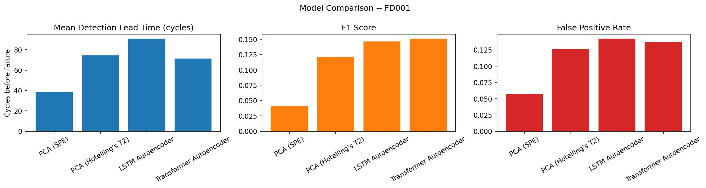

<div align="center">

# Multivariate Sensor Anomaly Detection — Turbofan Predictive Maintenance

Unsupervised failure detection on NASA's C-MAPSS turbofan degradation
dataset: detect engine degradation from reconstruction error — before
failure happens, not after.


[](https://www.nasa.gov/intelligent-systems-division/discovery-and-systems-health/pcoe/pcoe-data-set-repository/)

</div>

---

## Problem

Given multivariate sensor telemetry from a jet engine, detect that it is
degrading toward failure using only reconstruction error from a model
trained exclusively on healthy behavior. No labels are used during
training — RUL (remaining useful life) is used only for evaluation, keeping
this a genuine unsupervised anomaly detection problem rather than a
disguised regression task.

## Dataset

[NASA C-MAPSS Turbofan Engine Degradation Simulation](https://www.nasa.gov/intelligent-systems-division/discovery-and-systems-health/pcoe/pcoe-data-set-repository/)
— starting with **FD001** (100 train engines, 100 test engines, single
operating condition, single fault mode), the simplest of four sub-datasets.
21 sensor channels + 3 operational settings per cycle, run to failure
(train) or truncated before failure with a known true RUL (test). Not
committed to this repo (download instructions below).

## Approach

| Model | Role |
|---|---|
| PCA (SPE + Hotelling's T²) | Classical linear statistical baseline — no gradient boosting, no neural nets |
| LSTM autoencoder | Sequence reconstruction via a single compressed hidden-state vector, no attention |
| Transformer autoencoder | Reconstructs via cross-attention to the full encoded sequence, removing the LSTM's single-vector bottleneck |

All three are trained **only on healthy cycles** (the first ~30% of each
training engine's life) and evaluated by how their reconstruction error
rises as real degradation progresses.

## Evaluation

Deliberately different metrics from the point-forecast MAE/RMSE used in
prior projects, since this is a detection problem, not a regression one:

- **Detection lead time** — how many cycles before actual failure the model
  first raises a *sustained* alarm (persistence-filtered to avoid counting
  a single noisy spike as a genuine early warning), averaged across test
  engines — the single most practically meaningful number for a real
  maintenance system
- **Precision / recall / F1** on a binarized "final N cycles = true
  anomaly" label
- **False positive rate** on healthy portions of test engines — critical
  for real-world trust in a maintenance-alerting system

No SHAP, no drift monitoring, no quantile calibration — this project
deliberately does not reuse the explainability/monitoring narrative from
earlier projects in this portfolio.

## Repo structure

```
├── data/
│   ├── raw/                        # gitignored (place downloaded .txt files here)
│   │   ├── FD001/
│   │   │   ├── train_FD001.txt
│   │   │   ├── test_FD001.txt
│   │   │   └── RUL_FD001.txt
│   │   ├── FD002/
│   │   ├── FD003/
│   │   └── FD004/
│   └── processed/                  # gitignored (generated by data_pipeline.py)
│       ├── FD001/
│       │   ├── train_full.parquet
│       │   ├── train_healthy.parquet
│       │   ├── test.parquet
│       │   └── norm_stats.csv
│       ├── FD002/
│       ├── FD003/
│       └── FD004/
├── demo/                            # small, committed samples for the Streamlit demo
│   ├── sample_engines_FD001.parquet
│   └── thresholds_FD001.json
├── src/
│   ├── data_pipeline.py             # load, compute RUL, filter constant sensors, normalize on healthy cycles
│   ├── metrics.py                   # detection lead time (with persistence), precision/recall/F1, FPR
│   ├── baselines.py                 # PCA detector (SPE + Hotelling's T²), with save/load
│   ├── evaluate_pca_baseline.py     # trains + evaluates the PCA baseline
│   ├── lstm_autoencoder.py          # LSTM autoencoder: train, evaluate, shared windowing utilities
│   ├── transformer_autoencoder.py   # Transformer autoencoder (reuses lstm_autoencoder's utilities)
│   ├── compare_models.py            # pulls all three results into one comparison table + plot
│   ├── export_demo_artifacts.py     # exports the fitted PCA detector, demo engine sample, thresholds
│   └── streamlit_app.py             # interactive multi-model comparison demo
├── models/                          # trained checkpoints (gitignored)
├── reports/
│   ├── figures/                     # comparison plots
│   └── *.json / *.csv / *.md        # per-model and combined results
├── tests/
│   └── test_metrics.py
├── .github/workflows/tests.yml      # CI: runs the test suite on every push
├── config.yaml
├── pytest.ini
├── requirements.txt
├── .gitignore
└── LICENSE
```

## Setup

```bash
python -m venv venv && source venv/bin/activate      # Windows: venv\Scripts\Activate.ps1

# Install torch matching your CUDA version first (CPU-only also works fine --
# these models are small; training FD001 takes well under a minute on GPU)
pip install torch==2.13.0+cu126 --index-url https://download.pytorch.org/whl/cu126

pip install -r requirements.txt

# Download train_FD001.txt, test_FD001.txt, RUL_FD001.txt into data/raw/FD001/, then:
python src/data_pipeline.py --fd FD001 --raw_dir data/raw
```

Run the test suite:
```bash
pytest tests/ -v
```

## Status

- [x] Repo scaffolding
- [x] Data pipeline (RUL computation, constant-sensor filtering, healthy-window normalization)
- [x] Metrics module (detection lead time with persistence filtering, precision/recall/F1, FPR)
- [x] PCA baseline (SPE + Hotelling's T²)
- [x] LSTM autoencoder
- [x] Transformer autoencoder
- [x] Model comparison
- [x] Streamlit demo
- [x] CI (GitHub Actions)

## Results

### Model comparison (FD001, test set)

| Model | Mean lead time | Miss rate | Precision | Recall | F1 | FPR |
|---|---|---|---|---|---|---|
| PCA (SPE) | 31.5 | 98% | 0.042 | 0.057 | 0.048 | **1.2%** |
| PCA (Hotelling's T²) | 52.75 | 72% | 0.111 | 0.813 | **0.196** | 6.2% |
| LSTM Autoencoder | **93.6** | 61% | 0.080 | 1.0 | 0.148 | 14.1% |
| Transformer Autoencoder | 71.5 | 61% | 0.082 | 1.0 | 0.151 | 13.7% |



**No single detector wins across the board — and that's the actual
finding.** Which one is "best" genuinely depends on what a real maintenance
system needs to prioritize: earliest possible warning, or the fewest false
alarms eroding operator trust.

### PCA baseline: a genuine sensitivity limit, not a tuning problem

SPE achieves the lowest false-positive rate of any detector (1.2%) but
detects a sustained anomaly on only 2 of 100 engines — essentially unusable
standalone. Hotelling's T² is far more sensitive (recall 0.81) at the cost
of more false alarms. Lowering the detection threshold (p99 → p95) was
tested explicitly and made both detectors *worse*, not better — FPR nearly
tripled for T² while miss rate barely improved. This rules out threshold
miscalibration and confirms a genuine sensitivity limit: a single linear
projection cannot reliably separate this dataset's degradation pattern from
noise, a plausible result given that thermodynamic and mechanical wear
effects in a real jet engine do not combine linearly.

### LSTM autoencoder: capacity wasn't the bottleneck, architecture was

The first LSTM run (hidden_size=32) plateaued at val_loss≈0.50. Doubling
capacity to hidden_size=64 produced an almost identical result (val_loss
0.5015 vs 0.5011, converging in fewer epochs) — ruling out "needs more
capacity" as the explanation. The real constraint is structural: this
architecture reconstructs an entire 30-cycle window from a single fixed
vector (the encoder's final hidden state, repeated across every decoder
step). No matter how large that vector is, compressing 30 timesteps through
one summary and back out is lossy by design.

### Transformer autoencoder: a decisive fix, with an important caveat

Built specifically to remove that bottleneck: the decoder reconstructs the
window using cross-attention to the encoder's *full* output sequence, not a
single pooled vector. The result was dramatic — val_loss tracked the LSTM's
plateau almost exactly through epoch 17, then broke sharply downward at
epoch 18 and kept collapsing to **val_loss≈0.0019 by epoch 50**, a roughly
260x tighter reconstruction fit on healthy data than the LSTM ever achieved
at any capacity.

That improvement did **not** translate proportionally into better anomaly
detection. At the same p99 threshold convention used throughout this
project, the Transformer's precision/F1/FPR were actually slightly *worse*
than the LSTM's, despite the enormous reconstruction-quality gap. This is a
real, explainable finding, not a contradiction: a model that fits healthy
behavior *extremely* tightly also becomes more sensitive to ordinary,
benign inter-engine variation it hasn't seen — normal differences between
engines get flagged as anomalies too. Raising the threshold to p99.9
partially rebalanced this (better precision/F1/FPR than at p99) but cost
real lead time (86.0 → 71.5 cycles) — a genuine, no-free-lunch tradeoff
between sensitivity and specificity, not a bug to be optimized away.

**Reconstruction fidelity on healthy data and anomaly-detection quality are
not the same thing, and improving one does not guarantee improving the
other.** This is the central lesson of this project's model comparison.

## Demo

Interactive comparison of all three detectors on the same engine, showing
how each one's anomaly score evolves as the engine approaches failure. Each
score is normalized against its own detection threshold (1.0 = "this
detector fires here"), making the very different raw error scales directly
comparable on one chart:

```bash
python -m src.export_demo_artifacts --config config.yaml   # one-time, after training all three models
streamlit run src/streamlit_app.py
```

On engines close to true failure, the three detectors show visibly
different personalities: PCA's SPE stays noisy throughout with no clear
trend; Hotelling's T² and the LSTM track each other and rise gradually as
failure approaches; the Transformer stays *below* the others through most
of the engine's healthy life, then breaks away sharply in the final
cycles before failure, consistent with its far tighter healthy-data fit.

## Reference

Saxena, A., Goebel, K., Simon, D., & Eklund, N. (2008). Damage propagation
modeling for aircraft engine run-to-failure simulation. *2008 International
Conference on Prognostics and Health Management*, 1–9.

## License

This project is licensed under the MIT License — see [LICENSE](LICENSE) for details.